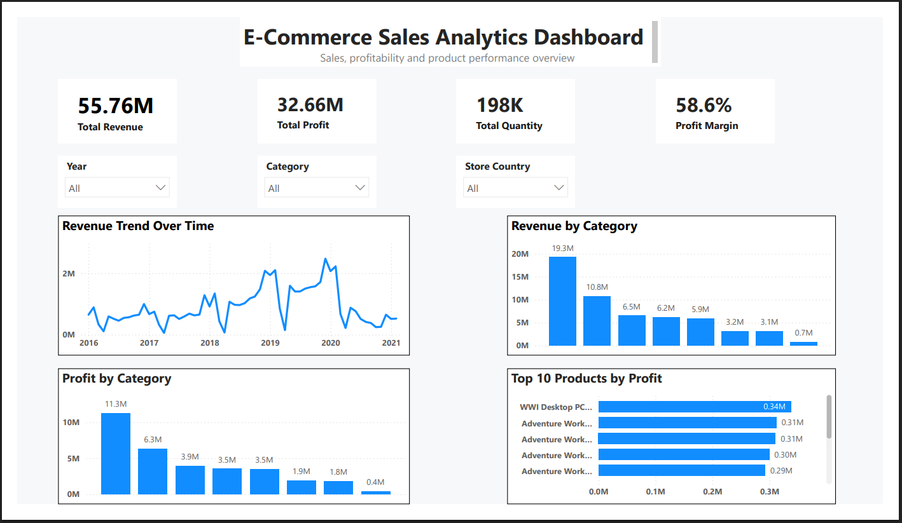

# E-Commerce Sales & Profitability Analytics Dashboard

An end-to-end data analytics project exploring sales performance, product profitability, and category dynamics across 62,884 global transactions. This project covers the full analytical lifecycle: from raw data integration and exploratory data analysis in Python (Pandas) to business metric modeling with DAX and interactive dashboard design in Power BI.

---

## Dashboard Preview



---

## Business Objective

In retail and e-commerce, top-line revenue growth can often mask underlying margin compression and cost inefficiencies. The primary objective of this project is to provide commercial leadership with clear visibility into:

1. **Volume vs. Profit Dynamics:** Identifying which product categories drive core revenue versus those that generate the highest profit margins.
2. **Product-Level Profit Contribution:** Uncovering the top-performing products that drive bottom-line margin.
3. **Revenue Trajectory & Regional Trends:** Enabling multi-dimensional filtering across years, product lines, and store countries to uncover sales patterns.
4. **Data-Driven Decision Making:** Transforming fragmented transaction and dimension data into an intuitive reporting tool for performance evaluation.

---

## Dataset Overview

The analysis was performed on an integrated transactional e-commerce dataset containing comprehensive sales and master data attributes:

| Attribute | Detail |
|---|---|
| **Total Transaction Volume** | 62,884 sales records |
| **Total Attributes** | 27 columns |
| **Domain Coverage** | Transactional sales, product catalog, brand classifications, category taxonomies, store locations, and customer/geographical details |

---

## Complete Project Workflow

The project followed a structured, end-to-end analytical pipeline:

```
Raw Data Files
     │
     ▼
Python / Pandas — Data Preparation
(Inspection, type validation, merging tables, handling overlapping columns)
     │
     ▼
Exploratory Data Analysis (EDA)
(Revenue, cost, profit, margin %, quantity, and unit economics across products & categories)
     │
     ▼
Business Metrics & Logic Formulation
(Defining core financial formulas & aggregation hierarchies)
     │
     ▼
Power BI — Data Import & Modeling
(Loading clean dataset and establishing visual hierarchies)
     │
     ▼
DAX Measure Engineering
(Explicit measures for revenue, profit, quantity, and margins with safe division)
     │
     ▼
Interactive Dashboard Design
(KPI cards, category breakdowns, top-product profit rankings, slicers, cross-filtering)
     │
     ▼
Business Insights & Portfolio Presentation
```

---

## Data Preparation & Integration (Python & Pandas)

Data integration and exploratory analysis were conducted in Python within a Jupyter Notebook (`ecommerce_analysis.ipynb`).

### 1. Data Cleaning & Integration

- **Dataset Inspection:** Assessed dataset shape (`(62884, 27)`), inspected column naming conventions, and verified data types across numeric and categorical variables.
- **Relational Merging:** Joined transactional sales tables with related dimension tables covering products, categories, stores, and brands.
- **Column Standardization & Overlap Resolution:** Handled duplicate and overlapping columns resulting from table joins to ensure a clean and consistent schema.

### 2. Exploratory & Aggregation Analysis

- Conducted aggregated breakdowns at both product-level and category-level.
- Evaluated total quantity sold against revenue, cost of goods, and net profit.
- Computed unit economics including Average Selling Price per product.
- Identified high-margin products and revenue-dominant categories through ranked aggregations.

---

## Core Business Metric Calculations

The following financial metrics were applied consistently throughout both the Python analysis and the Power BI data model:

| Metric | Formula |
|---|---|
| **Profit** | Revenue − Cost |
| **Profit Margin (%)** | (Profit ÷ Revenue) × 100 |
| **Average Selling Price (ASP)** | Revenue ÷ Quantity |

---

## Product-Level Unit Economics — Example

Detailed product-level aggregations were evaluated to assess unit economics, average selling price (ASP), and return margins.

**Representative High-Value Product Analysis:**

| Metric | Value |
|---|---|
| **Product** | Litware Refrigerator 24.7CuFt X980 White1939 |
| **Quantity Sold** | 7 units |
| **Total Revenue** | $22,399.93 |
| **Total Cost** | $7,421.54 |
| **Total Profit** | $14,978.39 |
| **Profit Margin** | 66.868021% |
| **Average Selling Price (ASP)** | $3,199.99 |

This unit-level analysis demonstrates that high-ASP items in major appliance categories maintain strong profitability margins even at lower sales volumes — underscoring the importance of analyzing margin alongside volume rather than revenue alone.

---

## Power BI Modeling & DAX Measures

To support dynamic filtering and responsive visual aggregation in Power BI, explicit DAX measures were constructed rather than relying on implicit column sums. This ensures all KPI cards and visuals respond correctly to every slicer selection.

### Total Revenue

```dax
Total Revenue = SUM('sales_analysis'[Revenue USD])
```

### Total Profit

```dax
Total Profit = SUM('sales_analysis'[Profit USD])
```

### Total Quantity

```dax
Total Quantity = SUM('sales_analysis'[Quantity])
```

### Profit Margin

`DIVIDE` is used to prevent division-by-zero errors and ensure safe execution across all filter contexts:

```dax
Profit Margin =
DIVIDE(
    [Total Profit],
    [Total Revenue],
    0
)
```

---

## Key Performance Indicators (KPIs) — Overall Summary

The global aggregated performance across all 62,884 records:

| KPI | Value |
|---|---|
| **Total Revenue** | $55.76M |
| **Total Profit** | $32.66M |
| **Total Quantity Sold** | ~198K units |
| **Overall Profit Margin** | 58.6% |

---

## Power BI Dashboard — Visuals & Layout

### Dashboard Visuals

| Visual | Purpose |
|---|---|
| **KPI Cards (×4)** | Instant summary of Total Revenue, Total Profit, Total Quantity, and Profit Margin |
| **Revenue Trend Chart** | Displays historical revenue trajectory across time periods |
| **Revenue by Category Chart** | Compares revenue volume contributions across all product categories |
| **Profit by Category Chart** | Compares net profit contributions across category portfolios |
| **Top 10 Products by Profit Chart** | Ranks individual products by absolute profit contribution |

### Interactive Slicers & Cross-Filtering

| Slicer / Feature | Functionality |
|---|---|
| **Year Slicer** | Filters all visuals by year to evaluate annual performance shifts |
| **Category Slicer** | Isolates any product category for focused trend analysis |
| **Store Country Slicer** | Enables regional and international market comparisons |
| **Cross-Filtering** | Selecting any visual element dynamically updates all other visuals and KPI cards |

---

## Category-Level Financial Breakdown

Analysis of all eight product categories reveals the distribution of revenue, cost, profit, and margin efficiency:

| Category | Revenue ($) | Cost ($) | Profit ($) | Profit Margin (%) |
|---|---:|---:|---:|---:|
| Music, Movies and Audio Books | 3,131,006.44 | 1,221,747.27 | 1,909,259.17 | 60.979088 |
| Cameras and camcorders | 6,520,168.02 | 2,600,367.03 | 3,919,800.99 | 60.118098 |
| TV and Video | 5,928,982.69 | 2,392,288.30 | 3,536,694.39 | 59.650948 |
| Computers | 19,301,595.46 | 8,024,147.56 | 11,277,447.90 | 58.427543 |
| Home Appliances | 10,795,478.59 | 4,499,139.74 | 6,296,338.85 | 58.323851 |
| Audio | 3,169,627.74 | 1,341,775.97 | 1,827,851.77 | 57.667711 |
| Cell phones | 6,183,791.22 | 2,685,164.68 | 3,498,626.54 | 56.577372 |
| Games and Toys | 724,829.43 | 328,160.66 | 396,668.77 | 54.725809 |

---

## Top 5 Products by Profit Contribution

Desktop PC configurations dominate the individual SKU profit rankings:

| Product | Revenue ($) | Cost ($) | Profit ($) |
|---|---:|---:|---:|
| WWI Desktop PC2.33 X2330 Black444 | 505,450.00 | 167,464.00 | 337,986.00 |
| Adventure Works Desktop PC2.33 XD233 Silver416 | 466,089.00 | 154,425.05 | 311,663.95 |
| Adventure Works Desktop PC2.33 XD233 Brown428 | 464,151.00 | 153,782.95 | 310,368.05 |
| Adventure Works Desktop PC2.33 XD233 Black422 | 447,678.00 | 148,325.10 | 299,352.90 |
| Adventure Works Desktop PC2.33 XD233 White433 | 437,019.00 | 144,793.55 | 292,225.45 |

---

## Key Business Insights

### 1. Revenue Volume vs. Margin Efficiency
- **Computers** is the dominant revenue category at $19.30M revenue and $11.28M profit — but its margin rate (58.43%) sits below the portfolio average.
- **Music, Movies and Audio Books** delivers the highest margin rate (60.98%) despite generating the second-lowest revenue ($3.13M), highlighting strong pricing power in smaller-volume segments.

### 2. High-ASP Products Drive Cash Flow Efficiency
- Top-ranked individual SKUs are all Desktop PC configurations, with the leading product (*WWI Desktop PC2.33 X2330 Black444*) generating $337,986 profit from $505,450 revenue.
- High unit prices combined with manageable cost of goods result in disproportionately strong per-SKU profit contributions.

### 3. Underperforming Segments Require Attention
- **Games and Toys** records both the lowest total revenue ($724,829) and the lowest margin rate (54.73%), indicating weaker pricing power or higher proportional unit costs relative to electronics categories.
- **Cell phones**, while sizeable in revenue ($6.18M), carries the second-lowest margin rate (56.58%), suggesting competitive pricing pressure compressing margins.

### 4. Overall Portfolio Health
- A 58.6% blended profit margin across ~198K units and $55.76M in revenue reflects a structurally healthy retail portfolio, with pricing discipline maintained broadly across all categories.

---

## Tools & Technologies

| Tool / Technology | Role |
|---|---|
| **Python (Pandas)** | Data inspection, cleaning, relational joins, schema standardization, and exploratory aggregation analysis |
| **Jupyter Notebook** | Interactive Python analysis environment |
| **Power BI Desktop** | Data modeling, DAX measure creation, visual design, and interactive dashboard development |
| **DAX (Data Analysis Expressions)** | Explicit measure engineering for dynamic KPI calculations |
| **Git & GitHub** | Version control, project documentation, and repository hosting |

---

## Repository Files

| File | Description |
|---|---|
| [`dashboard-preview.png`](dashboard.png) | High-resolution screenshot of the completed Power BI Dashboard |
| [`Ecommerce_analytics.ipynb`](ecommerce_analysis.ipynb) | Jupyter Notebook containing all Python/Pandas data preparation and exploratory analysis |
| [`Ecommerce-Sales-Analytics-Dashboard.pbix`](ECommerce-Sales-Analytics-Dashboard.pbix) | Complete Power BI Desktop project file with data model, DAX measures, and interactive visuals |

---

## Key Learning Outcomes

- Executing a multi-stage analytical workflow connecting programmatic data preparation in Python directly to visual business intelligence in Power BI.
- Applying relational data integration techniques (table joins, schema deduplication) outside of a database environment using Pandas.
- Formulating financial business metrics and handling mathematical edge cases using robust, explicit DAX measures.
- Designing a user-centric dashboard layout that balances high-level executive KPIs with granular product and category drilldowns.
- Communicating analytical findings with strict fidelity to empirical dataset results — without overstating or fabricating insights.

---

## Final Project Outcome

This project delivers a complete, validated analytics solution providing retail decision-makers with instant visibility into commercial performance, margin drivers, and product profitability across global sales operations — built on a rigorous, reproducible analytical foundation spanning Python-based data engineering and Power BI visual storytelling.

---
